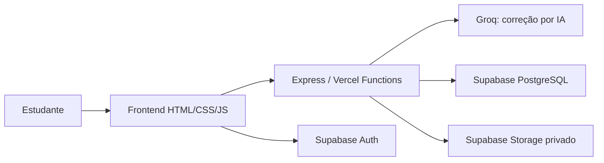
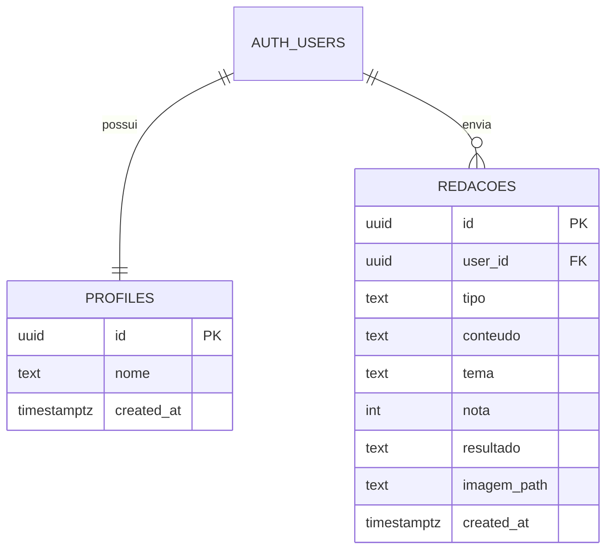
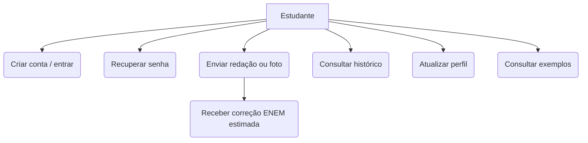

# Material de apoio à banca — Português+

## Problema e proposta

Estudantes que praticam redação no modelo ENEM precisam de retorno rápido, organizado e acessível. O Português+ oferece editor de texto, correção pedagógica por IA, envio de foto, exemplos de desempenho e histórico individual para apoiar ciclos de escrita, feedback e reescrita.

## Requisitos funcionais

| Código | Requisito |
| --- | --- |
| RF01 | Criar conta, autenticar e encerrar sessão. |
| RF02 | Recuperar senha por e-mail. |
| RF03 | Escrever redação e informar tema. |
| RF04 | Enviar redação por texto ou foto. |
| RF05 | Gerar correção estimada nas cinco competências ENEM. |
| RF06 | Exibir nota, sugestões e pontos de atenção. |
| RF07 | Consultar histórico, média e melhor nota. |
| RF08 | Atualizar perfil e consultar política de privacidade. |

## Requisitos não funcionais

| Código | Requisito |
| --- | --- |
| RNF01 | Interface responsiva para celular e desktop. |
| RNF02 | Dados protegidos por autenticação e RLS do Supabase. |
| RNF03 | Fotos em bucket privado. |
| RNF04 | Correção informada como estimativa pedagógica. |
| RNF05 | Chaves de IA mantidas somente no backend. |

## Arquitetura

## Modelo de dados

## Casos de uso

## Plano de testes

| Cenário | Resultado esperado | Evidência |
| --- | --- | --- |
| Texto com menos de 10 linhas | Nota 0 e orientação para desenvolver | `npm test` |
| Histórico no modo local | Retorna lista vazia sem erro | `npm test` |
| Foto inválida | API responde 400 | `npm test` |
| Correção válida | Retorna nota e cinco competências | Teste manual com Groq configurada |
| Sem token em produção | API responde 401 | Teste manual com `LOCAL_DEMO_AUTH=false` |
| Cadastro, login e recuperação | Fluxo do Supabase exibido ao estudante | Teste manual |

## Limitações e trabalhos futuros

- A IA fornece uma estimativa pedagógica; a nota oficial depende da avaliação humana do ENEM.
- É recomendável incluir gráficos de evolução, exclusão de redações pelo estudante e painel administrativo em uma próxima versão.
- A disponibilidade da correção depende da API externa de IA.
